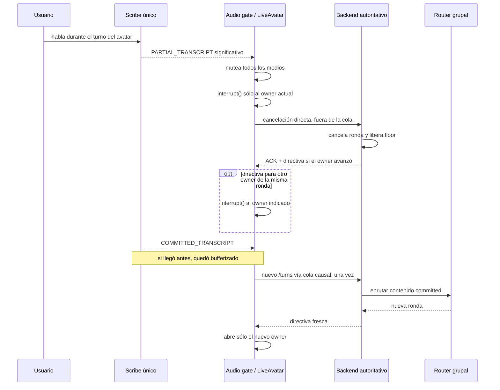

# Floor grupal preemptivo exclusivo del usuario

## Estado

accepted

Enmendado el 2026-08-25 para reducir el alcance después de QA real. La decisión vigente es el barge-in humano mínimo; la persistencia causal del fragmento audible y su state machine fueron retirados.

Este registro consolida y reemplaza [ADR 0018](0018-atomic-elevenlabs-group-agents.md) y [ADR 0019](0019-strict-floor-independent-liveavatar-group-sessions.md).

## Plan relacionado

[Plan 38: Floor grupal preemptivo exclusivo del usuario](../../plan-prompts/38-user-preemptible-group-call-floor.md)

## Fecha

Decisión original: 2026-08-24. Enmienda de alcance: 2026-08-25.

## Enmienda de alcance tras QA

La decisión original combinaba dos objetivos: permitir el corte humano y reconstruir con precisión qué parte de la respuesta había sido audible. Para el segundo objetivo se implementó captura de `AVATAR_TRANSCRIPTION`, persistencia de un mensaje `interrupted`, reconciliación con `agent_response_correction`, una gracia temporal antes del reenrutado, receipts enriquecidas con contenido y recovery específico.

Aunque ese diseño era causalmente más completo en papel y contaba con cobertura automatizada, el QA de la llamada real mostró dos regresiones de mayor impacto: momentos con avatares simultáneos y sesiones que quedaban sin audio. El problema surgía de acoplar varios relojes y autoridades asíncronas —audio gate local, owner del floor, ACK del backend, callbacks del provider, corrección tardía, timer de gracia, transcript committed y estado del historial— para decidir cuándo cerrar y volver a abrir la conversación.

El mismo QA mostró un problema independiente durante el inicio: los saludos automáticos del provider estaban muteados, pero seguían ejecutándose. Varios avatares podían quedar animados como si hablaran al mismo tiempo aunque no se oyera su voz. El alcance reducido corta cada startup cue con `session.interrupt()` y conserva el gate en `null`; esta supresión no es un barge-in conversacional ni cancela una ronda humana.

Se retiró esa coordinación compleja. No se oculta ni se reescribe como si nunca hubiera existido: queda registrada aquí como una hipótesis implementada, probada y descartada porque reducía la confiabilidad del objetivo principal. El core de ADR 0023 continúa aceptado: sólo la persona puede preemptar una ronda grupal y lo hace mediante el Scribe único.

## Contexto

ADR 0018 fijó a cada ElevenLabs Agent como unidad atómica de conocimiento, generación y voz. ADR 0019 estabilizó las llamadas grupales con sesiones LiveAvatar LITE independientes, un solo Scribe y un floor que permite un único avatar audible. Esa combinación resolvió la superposición, las respuestas duplicadas y el avance de rondas por eventos tardíos.

La restricción no preemptiva introdujo un problema de producto: si una respuesta era larga, incorrecta o ya no era relevante, la persona debía esperar al avatar y al resto de la ronda antes de corregir, detener o cambiar la prioridad. Scribe seguía escuchando, pero el frontend descartaba el habla humana mientras había un floor activo. La cola continuaba respondiendo sobre una intención que podía haber quedado obsoleta.

La mejora debe preservar las garantías del plan 37: sesiones independientes, Agents atómicos, backend autoritativo, un solo micrófono y máximo un avatar audible. “Sólo el usuario” designa cualquier habla capturada por el micrófono del navegador; no supone identificación biométrica de la persona.

## Opciones consideradas

1. **Mantener el floor no preemptivo.** Conserva el flujo más simple, pero obliga a esperar y deja sin uso una señal humana que Scribe ya entrega con baja latencia.
2. **Habilitar el micrófono de cada connector LiveAvatar.** Delegaría el corte a cada Agent, pero duplicaría STT, podría despertar varios Agents a la vez y rompería la autoridad del router.
3. **Ofrecer solamente un botón manual.** Es explícito y puede ser un fallback accesible, aunque agrega fricción a una interacción cuyo canal principal es la voz.
4. **Agregar VAD o WebAudio propio.** Puede detectar audio antes de contar con texto, a costa de otra fuente de verdad y más falsos positivos por eco o ruido.
5. **Scribe preemptivo con persistencia causal del fragmento.** Fue la decisión original: ofrecía un transcript más fiel, pero su coordinación asíncrona produjo superposición y silencio en QA real.
6. **Scribe preemptivo mínimo.** Separa el corte inmediato del reenrutado committed y no intenta reconciliar la respuesta parcial del avatar. Es la opción vigente.

## Decisión

Adoptamos un floor asimétrico: sigue siendo estricto y no preemptivo entre avatares, pero la voz humana capturada por el Scribe único puede cancelar la ronda vigente.

El flujo autoritativo mínimo es:

1. El primer `PARTIAL_TRANSCRIPT` significativo detectado durante un floor en `queued`, `speaking` o `committing`, o con una directiva queued pendiente, origina el corte. Se normaliza el texto y se ignoran únicamente backchannels aislados: `si/sí`, `aja/ajá`, `ok/okay`, `dale`, `claro`, `mmm`, `eh`.
2. El navegador mutea todos los medios inmediatamente e invoca `LiveAvatarSession.interrupt()` una sola vez sobre la instancia del owner capturado.
3. El backend registra una receipt mínima y cancela toda la ronda anclada al turno esperado. Si el floor avanzó de A a B dentro de esa ronda, devuelve una directiva para cortar también a B; el cliente la ejecuta con el gate cerrado antes de confirmar el ACK. Si la ronda anclada ya está inactiva, responde `stale` sin modificar una posterior.
4. `COMMITTED_TRANSCRIPT` no origina el corte: completa la intervención iniciada por el parcial. Si llega antes del ACK de cancelación, el navegador lo bufferiza.
5. Un latch reúne ACK y contenido committed. Cuando ambos existen, el nuevo `/turns` se incorpora una sola vez a la cola causal de eventos que afectan el floor. El gate continúa cerrado hasta que su respuesta entrega una directiva fresca.

La respuesta parcial interrumpida no se persiste, no se marca en el historial y no se incorpora al contexto siguiente. El reenrutado no espera `AVATAR_TRANSCRIPTION`, `agent_response_correction` ni un timer de gracia. Un evento provider `interruption` tampoco origina por sí solo una preempción humana.

## Fundamentos

Scribe sigue siendo el único oído humano; YUNI sigue decidiendo y persistiendo rondas; cada ElevenLabs Agent conserva su Knowledge Base, generación, TTS y voz; LiveAvatar sigue renderizando cada avatar; y el navegador conserva el gate de audibilidad.

La versión reducida mantiene las dos sincronizaciones necesarias y observables: cortar al primer parcial significativo y no reenrutar hasta que la ronda anterior esté cancelada y la frase humana esté committed. Eliminar la reconciliación del fragmento reduce autoridades concurrentes y callbacks capaces de reabrir audio o avanzar el floor fuera de orden.

Se acepta que el transcript no represente la porción incompleta que la persona alcanzó a oír. Para el MVP, una llamada estable, un único hablante y la capacidad de corregir superan el beneficio de esa fidelidad adicional.

## Notas de implementación

- El barge-in sólo se evalúa con llamada saludable, micrófono activo y un turno `queued`, `speaking` o `committing`, incluida una directiva queued pendiente.
- El corte local precede a cualquier request de red: primero `applyAudioGate(null)`, luego `interrupt()` del owner capturado y finalmente cancelación autoritativa.
- `POST /group-voice-sessions/:sessionId/interrupt` exige el body estricto `{ reason: "user", trigger: "voice", sourceEventId, expectedAvatarId, expectedTurnId }`. `sourceEventId` tiene entre 1 y 160 caracteres; `spokenFragment` no existe.
- La cancelación se ancla a `expectedTurnId`, cancela la ronda completa, marca sus turnos pendientes como interrumpidos y deja la sesión en `listening` sin floor. Si el owner avanzó dentro de la misma ronda, la respuesta ordena interrumpir también al owner nuevo.
- Cualquier `speak_started` que llegue de cualquier connector mientras la interrupción está pendiente se suprime con `interrupt()` local, sin otro POST ni una mutación adicional del floor.
- La receipt durable es única por sesión y `sourceEventId`, se ancla a ronda/turno y no contiene texto. Un retry devuelve `duplicate`; sólo repite una directiva mientras no exista una ronda posterior y la sesión continúe libre.
- La migración conserva `spokenFragmentLength` como columna histórica siempre igual a `0`; no representa una capacidad vigente.
- Una corrección o callback tardío del turno interrumpido se rechaza por lease inválido; no crea un mensaje ni modifica una ronda posterior.
- El cliente conserva sólo el mínimo estado transitorio necesario para juntar ACK y transcript committed y deduplicar el envío del turno humano.
- Para minimizar latencia, el POST de cancelación se dispara directamente después del gate/SDK interrupt y no entra en `orchestrationQueueRef`. El latch ACK+commit ordena el paso siguiente; sólo el nuevo `/turns` se incorpora a esa cola causal. El gate permanece en `null` hasta que su resultado autoriza audio.
- Si la nueva ronda reutiliza el mismo connector, su `user_message` espera el terminal del episodio interrumpido. Cada `user_message` de turno lleva `event_id` y los callbacks se correlacionan con `source_event_id`; un callback viejo o ambiguo nunca puede cortar ni completar el turno nuevo.
- No forman parte del flujo `spokenFragment`, mensajes assistant parciales, metadata de historial `interrupted`, reconciliación tardía, gracia de un segundo ni una UI de recovery específica.
- El evento provider `interruption` es telemetría/no-op y nunca libera el floor.
- Durante startup, el primer `speak_started` de cada sesión se corta con `session.interrupt()` y el gate permanece en `null`. Esa señal no llama al endpoint de interrupción humana.
- El micrófono se puede activar o desactivar durante un floor normal. Muteado no hay barge-in y el toggle se bloquea mientras la interrupción está pendiente.
- Si la cancelación falla o no confirma `phase: "listening"` con `floor: null`, el audio queda muteado, se muestra el error y no se ejecuta retry manual, automático ni una ruta alternativa.
- Se mantienen `echoCancellation` y `noiseSuppression`; `filterBackgroundAudio` no se habilita sin validación adicional.

## Impacto de usuario/producto

La persona puede corregir una premisa, frenar una explicación o cambiar de prioridad sin esperar al resto de la ronda. La UI hace visible que hablar durante el turno corta al avatar y confirma el estado mientras se cancela la ronda.

El costo de la simplificación es visible en el historial: no aparece la respuesta incompleta del avatar ni una etiqueta “Interrumpido”. La siguiente ronda conoce el último contexto ya persistido y el pedido humano nuevo, no el fragmento que alcanzó a reproducirse.

Las llamadas individuales no cambian y el botón manual compartido continúa fuera de alcance para esta entrega.

## Tradeoffs de costo, UX y seguridad

- **UX:** el parcial reduce la latencia percibida, pero eco, ruido o reconocimiento provisional pueden producir falsos positivos. La lista de backchannels mitiga cortes accidentales sin clasificar intención compleja.
- **Confiabilidad:** retirar corrección, gracia y recovery reduce fidelidad del transcript, pero elimina dependencias asíncronas que en QA causaron audio simultáneo o ausente.
- **Provider:** LiveAvatar no ofrece un fade-out exacto del audio que el connector ya reproduce. El mute local da el corte perceptible más temprano disponible.
- **Identidad:** el navegador conoce el canal de micrófono, no la identidad física del hablante. Cualquier voz capturada puede interrumpir.
- **Costo:** se reutiliza Scribe y no se agregan conversaciones ElevenLabs ni sesiones LiveAvatar. No se almacena contenido adicional por el corte.
- **Privacidad:** el nuevo contenido humano sigue las reglas del transcript grupal; la porción parcial del avatar se descarta.

## Fuentes

- [Plan 38: Floor grupal preemptivo exclusivo del usuario](../../plan-prompts/38-user-preemptible-group-call-floor.md)
- [ADR 0018: Agents atómicos de ElevenLabs](0018-atomic-elevenlabs-group-agents.md)
- [ADR 0019: Floor estricto con sesiones LiveAvatar grupales independientes](0019-strict-floor-independent-liveavatar-group-sessions.md)
- [ElevenLabs: transcripts y estrategias de commit en Scribe Realtime](https://elevenlabs.io/docs/eleven-api/guides/how-to/speech-to-text/realtime/transcripts-and-commit-strategies)
- [ElevenLabs: `agent_response_correction`, evaluado en el alcance original retirado](https://elevenlabs.io/docs/eleven-agents/customization/events/client-events)
- [LiveAvatar LITE configuration](https://docs.liveavatar.com/docs/lite-mode/configuration)
- [LiveAvatar ElevenLabs Agent Connector](https://docs.liveavatar.com/docs/lite-mode/connectors/elevenlabs-agent)
- [Guía operativa de llamadas grupales](../../integrations/group-calls-elevenlabs-liveavatar.md)
- [Tests de lifecycle de la llamada grupal](../../../apps/web/group-interact-call.lifecycle.test.tsx)
- [Tests de integración transaccional del floor](../../../packages/db/src/avatar-group-floor.integration.test.ts)
- [Tests del servicio de grupos](../../../apps/api/src/domains/avatar-groups/service.test.ts)

## Evidencia y validación

- La primera implementación contó con tests para receipts, correcciones tardías, timers de gracia y contexto causal. Esa cobertura validó sus ramas aisladas, pero no evitó la regresión emergente observada con los providers reales.
- El QA real del 2026-08-25 detectó audio simultáneo y avatares silenciosos durante interrupciones. Esa evidencia motivó retirar la coordinación de fragmento/corrección/gracia y priorizar el flujo mínimo.
- También detectó que mutear los saludos de startup sin cortarlos dejaba varios avatares animados “hablando sin voz”; el lifecycle vigente interrumpe una vez cada cue y mantiene todos los videos muteados.
- La cobertura vigente debe verificar: parcial significativo, backchannels, mute local antes de red, interrupción exclusiva del owner, cancelación de toda la ronda, commit antes/después del ACK y un único reenrutado.
- El checklist operativo incluye pruebas con parlantes y auriculares para detectar eco, falsos positivos, superposición y pérdida de audio.

## Preguntas abiertas

- ¿Conviene activar `filterBackgroundAudio` después de comparar falsos positivos, latencia y calidad en navegadores soportados?
- ¿Cómo debe coordinarse el floor humano si una futura llamada grupal admite varios clientes o micrófonos simultáneos?
- ¿Qué fallback manual accesible debe ofrecerse si Scribe se desconecta o la persona no puede usar voz?
- ¿Puede una futura integración con control autoritativo de playback registrar el fragmento audible sin reintroducir autoridades asíncronas en el cliente?
